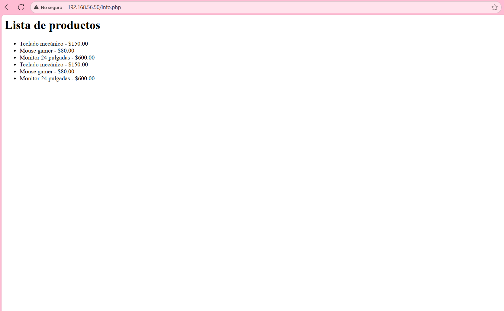

# Taller Vagrant + Provisionamiento con Shell

## Descripción
Este proyecto implementa un entorno virtualizado con **Vagrant**, compuesto por dos máquinas virtuales:  
- **Web:** Servidor Apache con PHP.  
- **DB:** Servidor PostgreSQL con una base de datos y tabla inicial.  

El aprovisionamiento se realiza mediante **scripts en Bash**, que automatizan la instalación, configuración y despliegue del entorno.  
El objetivo es comprender cómo funcionan las máquinas virtuales, la automatización de instalación de servicios y la comunicación entre ellas.

## Pasos de instalación

### 1. Clonar el repositorio
Clone este repositorio en su máquina local y acceda al directorio del proyecto.

### 2. Levantar las máquinas
Ejecute el siguiente comando para crear y aprovisionar las máquinas automáticamente:
---
vagrant up
---

Esto creará dos máquinas virtuales:
- **web** → `192.168.56.50`
- **db** → `192.168.56.51`

### 3. Acceder a la aplicación
Una vez completado el aprovisionamiento, abra un navegador web y acceda a:
---
http://192.168.56.50/
---

Podrá visualizar los archivos `index.html` y `info.php` funcionando correctamente.

---

Imagen del proyecto funcionando:

